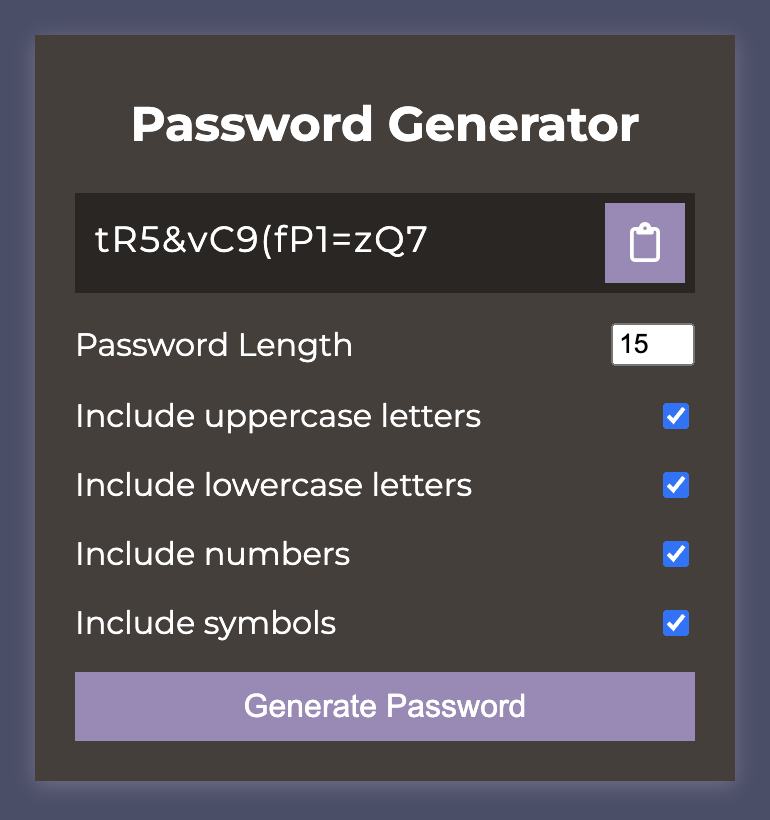

# Password Generator - a DOM manipulation exercise

In this app, you can choose several parameters for the random password that will be generated by the app. These parameters include the character length and inclusion of: uppercase letters, lowercase letters, numbers and symbols. You can also choose to let the app copy the password to the clipboard.
This is a DOM manipulation exercise that I did, folowing along with a tutorial.

### Links

- Solution URL: [click here](https://github.com/climaco-sarmiento/password-generator)
- Live Site URL: [click here](https://climaco-sarmiento.github.io/password-generator/)

### Screenshot

## Author

- Website - [Ubaid Khalid](https://www.ubaidkhalid.dev)
- LinkedIn - [Ubaid Khalid](https://www.linkedin.com/in/ubaid-khalid-dev/)
